# Table of contents

 <!-- MDTOC maxdepth:6 firsth1:1 numbering:0 flatten:0 bullets:1 updateOnSave:1 -->

- [Table of contents](#table-of-contents)   
- [DEPLOYMENT SCENARIO](#deployment-scenario)   
- [DEPLOYMENT PREREQUISITES](#deployment-prerequisites)   
- [CONFIGURATION STEPS OVERVIEW](#configuration-steps-overview)   
- [API KEYS AND CONFIG FILE PREPARATION](#api-keys-and-config-file-preparation)   
   - [Set up an Oracle Cloud Infrastructure API Signing Key for Use with Oracle Functions](#set-up-an-oracle-cloud-infrastructure-api-signing-key-for-use-with-oracle-functions)   
   - [Prepare SSH keys](#prepare-ssh-keys)   
- [Configure Oracle Cloud](#configure-oracle-cloud)   
   - [Create Virtual Cloud Network (VCN)](#create-virtual-cloud-network-vcn)   
      - [Create VCN](#create-vcn)   
      - [Modify Management and Server subnets](#modify-management-and-server-subnets)   
   - [Create Public NETWORK](#create-public-network)   
      - [Modify VCN Security Policy](#modify-vcn-security-policy)   
- [Create a10 vThunder instances](#create-a10-vthunder-instances)   
   - [Create Primary ADC instance](#create-primary-adc-instance)   
      - [ATTACH VNICs to the ADC](#attach-vnics-to-the-adc)   
   - [Create Secondary ADC instance](#create-secondary-adc-instance)   
      - [ATTACH VNICs to the ADC](#attach-vnics-to-the-adc)   
- [A10 vThunder CONFIGURATION](#a10-vthunder-configuration)   
   - [Configuring the primary vThunder device](#configuring-the-primary-vthunder-device)   

<!-- /MDTOC -->


# DEPLOYMENT SCENARIO
For this deployment example,a web application service with a pair if vThunder VM's are deployed in one region using two available domains for redundancy in Oracle Cloud Infrastructure (OCI).


_Figure 1:_ Example deployment topology and network information

# DEPLOYMENT PREREQUISITES
To deploy vThunder ADC for a business application running in OCI, the user needs the following:
* Oracle Cloud Infrastructure accounts and access information
* vThunder ADC (image available in the Oracle Cloud Marketplace)
* vThunder License
* SSH key pair for SSH and console access to vThunder
* Oracle API Public and Private Key pair

# CONFIGURATION STEPS OVERVIEW
The high-level configuration steps of this example deployment are as follows:
1. Prepare Oracle API Public and Private Keys
1. Prepare API keys (used for HA failover operation)
1. Define and set VCN, subnets, and security rules in Oracle Cloud
1. Install two vThunder ADC instances
1. Configure vThunder ADC
  1. General and interfaces
  1. High-availability (VRRP-A and failover) configuration
  1. SLB virtual service (VIP) configuration

# API KEYS AND CONFIG FILE PREPARATION

API keys are required to perform the VRRP-A failover process in an Oracle Cloud Infrastructure deployment. vThunder supports unicast-based VRRP-A to provide redundancy when an active vThunder goes down for any reason. In the Oracle Cloud environment, a public IP address is assigned for a VIP as a secondary IP on the uplink / gateway facing interface. The secondary public IP address(es) have to be moved from the failed vThunder to a new active vThunder when the failover is triggered. The A10 vThunder in the Oracle Cloud implements this workflow and can automatically move the VIP address(es) and other floating IP addresses to the new active vThunder using API-based Oracle functions.
The following files need to be prepared before starting the vThunder configuration.

* API key pair to create API signing key. For example,
  * Private key: oci_api_key.pem (RSA 2K key, PEM format)
  * Public key: oci_api_key_pub.pem

## Set up an Oracle Cloud Infrastructure API Signing Key for Use with Oracle Functions
Before using Oracle Functions, you have to set up an Oracle Cloud Infrastructure API signing key.

The instructions in this topic assume:

  * you are using Linux
  * you are following Oracle's recommendation to provide a passphrase to encrypt the private key

To set up an API signing key:

1. Log in to a Linux workstation.
1. In a terminal window, confirm that the `~/.oci` directory does not already exist. For example, by entering:
`ls  ~/.oci`
1. Assuming the `~/.oci` directory does not already exist, create it. For example, by entering:
`mkdir ~/.oci`
1. Generate a private key encrypted with a passphrase that you provide by entering:
```
$ openssl genrsa -out ~/.oci/<private-key-file-name>.pem -aes128 2048
```
where `<private-key-file-name>` is a name of your choice for the private key file (for example, `oci_api_key.pem`).

For example:
```
$ openssl genrsa -out ~/.oci/oci_api_key.pem -aes128 2048
'Generating RSA private key, 2048 bit long modulus'
....+++
....................................................................+++
e is 65537 (0x10001)
Enter pass phrase for /Users/johndoe/.oci/oci_api_key.pem:
```
When prompted, enter a passphrase to encrypt the private key file.
* Be sure to make a note of the passphrase you enter, as you will need it later.  
When prompted, re-enter the passphrase to confirm it.

Confirm that the private key file has been created in the directory you specified. For example, by entering:
```
$ ls -l ~/.oci/oci_api_key.pem

-rw-r--r-- 1 johndoe staff 1766 Jul 14 00:24 /Users/johndoe/.oci/oci_api_key.pem
```
Change permissions on the file to ensure that only you can read it. For example, by entering:
```
$ chmod go-rwx ~/.oci/oci_api_key.pem
```
Generate a public key (in the same location as the private key file) by entering:
```
$ openssl rsa -pubout -in ~/.oci/<private-key-file-name>.pem -out ~/.oci/<public-key-file-name>.pem
```
where:

`<private-key-file-name>` is what you specified earlier as the name of the private key file (for example, `oci_api_key.pem`)
`<public-key-file-name>` is a name of your choice for the public key file (for example, `oci_api_key_pub.pem`)

For example:
```
$ openssl rsa -pubout -in ~/.oci/oci_api_key.pem -out ~/.oci/oci_api_key_pub.pem

Enter pass phrase for `/Users/johndoe/.oci/oci_api_key.pem`:
```
When prompted, enter the same passphrase you previously entered to encrypt the private key file.
Confirm that the public key file has been created in the directory you specified. For example, by entering:
```
$ ls -l ~/.oci/
-rw------- 1 johndoe staff 1766 Jul 14 00:24 oci_api_key.pem
-rw-r--r-- 1 johndoe staff 451 Jul 14 00:55 oci_api_key_pub.pem
```
Copy the contents of the public key file you just created. For example, by entering:
```
$ cat ~/.oci/oci_api_key_pub.pem | pbcopy
```
Having created the API key pair, upload the public key value to Oracle Cloud Infrastructure:

Log in to the Console as the Oracle Cloud Infrastructure user who will be using Oracle Functions to create and deploy functions.

1. In the top-right corner of the Console, open the **Profile** menu (User menu icon) and then
1. Click **User Settings** to view the details.
1. On the **API Keys** page, click Add **Public Key**.

Paste the public key's value from the `oci_api_key_pub.pem` into the window and click Add.

The key is uploaded and its fingerprint is displayed (for example, `d1:b2:32:53:d3:5f:cf:68:2d:6f:8b:5f:77:8f:07:13`).

> **Note the fingerprint value. You'll use the fingerprint in a subsequent configuration task.**

## Prepare SSH keys
During the vThunder deployment an SSH Key pair is required to allow SSH access to the instances after deployment.  The following steps will outline the process to generate the key pair using the `puttygen` utility.
1. Install putty on your workstation from the putty site:  https://www.chiark.greenend.org.uk/~sgtatham/putty/latest.html
1. After the installation is complete run the `puttygen` utility
1. Select `Key` dropdown and verify that it is set to `SSH-2 RSA`
1. For the type of key to generate, select `RSA` with `2048` bits
1. Select the `Generate` button and move the mouse in the empty area until the key has been successfully generated.
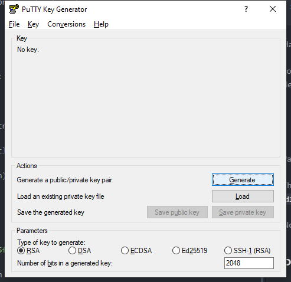
1. Click the `Save public key` and save the file as `ssh_key.pub`
1. Click the `Save Private Key` and save the priate key as `ssh_key_priv.ppk` NOTE:  the .ppk file is used by Putty
1. Under the Key section, select the text in the box labeled `Public key for pasting into OpenSSH authorized_keys file`
   1. Right-Click the window and `select-all`
   </BR>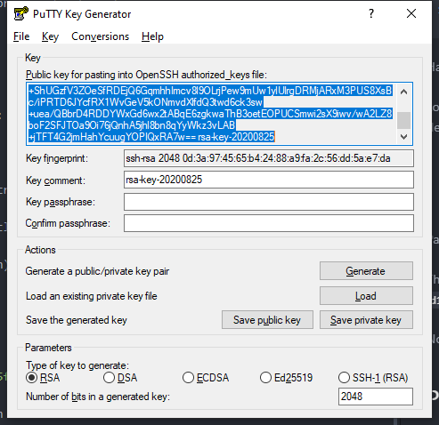
   1. Paste the text into a notepad document and save it in the same folder as the other keys.
   authorized_keys_notepad.png
   1. Save the file as `authorized_keys.pub`  
   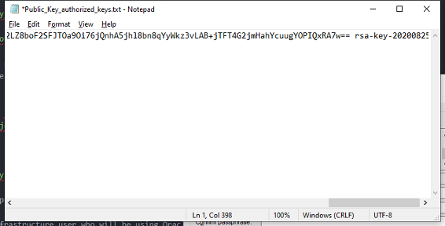
1. Select the `Conversions` dropdown and select `export OpenSSH key` and save the file as `ssh_key` with no extension.

# Configure Oracle Cloud
## Create Virtual Cloud Network (VCN)
The next step is to create the VCN within Oracle Cloud.  Table 1 reflects the VCN network and the sub-networks contained within the VCN.  

**Table 1:  Example VCN and Subnet Assignement**

Components|Name|Value|Notes
--------------|--------------|--------------|--------------
Region|US-West PHoenix||
Available Domains|PHX-AD-1, PHX-AD-2, PHX-AD-3||
VCN|VCN-a10demo|10.0.0.0/20| Main Network that contains subnets below
Subnet|Management|10.0.0.0/24|Public/Regional
 -|Public|10.0.1.0/24|Public/Regional
 -|Server|10.0.10.0/24|Private/Regional
 -|HA|10.0.3.0/24|Private/Regional

### Create VCN
1. Login to the Oracle Cloud web interfaces
1. Select the "hamburger" menu dropdown in the upper left corner, Select `Networking/Virtual Cloud Networks`
1. Click on the `Start VCN Wizard` and
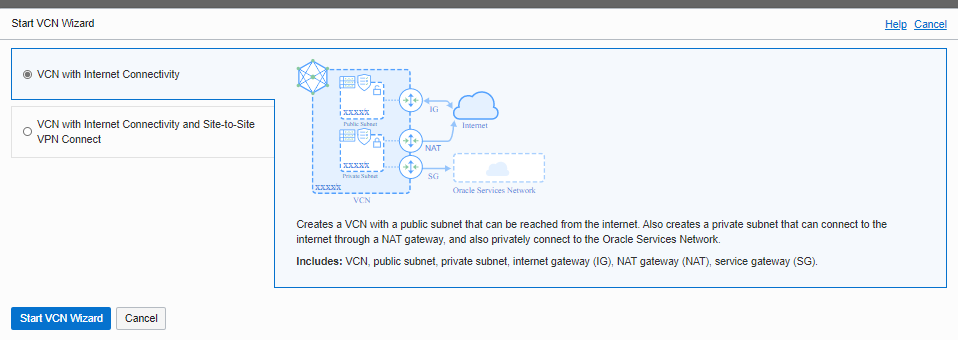
1. Fill out the form with the following parameters:
   1. Name:  `VCN_a10demo`
   1. VCN CIDR BLOCK: `10.0.0.0/20`
   1. Public Subnet CIDR Block:  `10.0.0.0/24` *NOTE: This will become the Management Network*
   1. Private Subnet CIDR Block:  `10.0.2.0/24` *NOTE: This will become the Server Network*
   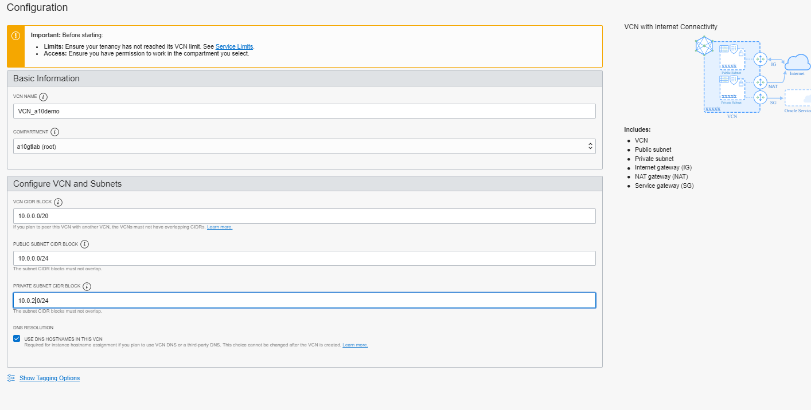
1. Select `Next`
1. Select `Create`

### Modify Management and Server subnets
1. Go into the `VCN_a10dmo` configuration page
1. Select `Public Subnet-VCN_a10demo`
1. Select `Edit`
1. Change Name to `Management_Network` and `Save Changes`
   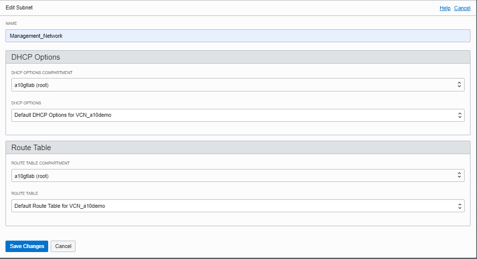
1. Select `Pr Subnet-VCN_a10demo`
1. Select `Edit`
1. Change Name to `Management_Network` and `Save Changes`
   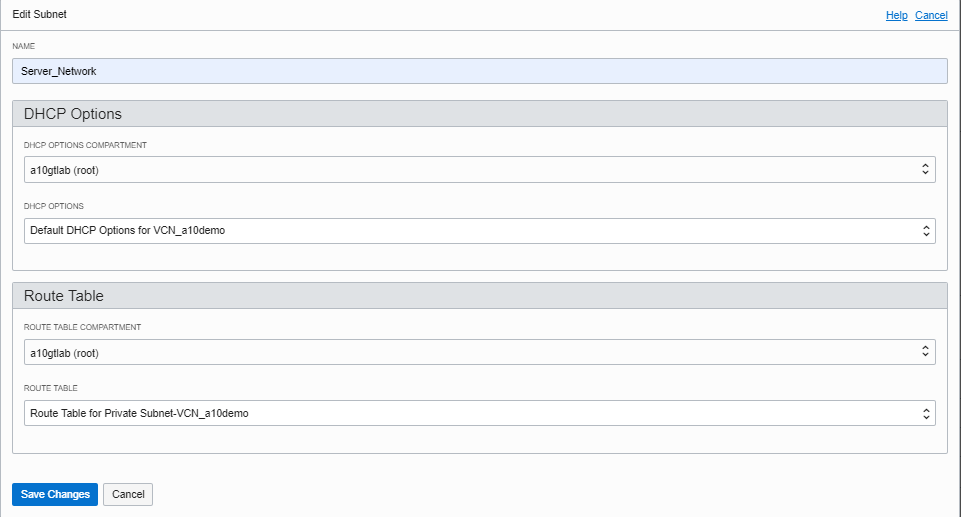

## Create Public NETWORK
1. Create Route Table by going into Route tables under resources and choosing `Create Route Table`
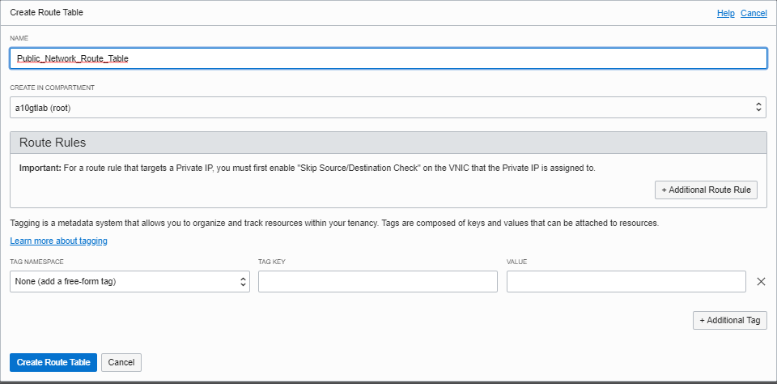
1. Go the the 'Subnets' screen and select `Create Subnet`
1. Create the Public Network using the following configuration:
   1. Name:  `Public_Network`
   1. Subnet Type:  `Regional`
   1. CIDR BLOCK: `10.0.1.0/24`
   1. Route Table: `Default Route Table for VCN_a10demo`
   1. Subnet Access:  `Public Subnet`
   1. DHCP Options: `Default DHCP Options for VCN_a10demo`
   1. Security List: `Default Security List for VCN_a10demo`
   1. Choose `Create Subnet`
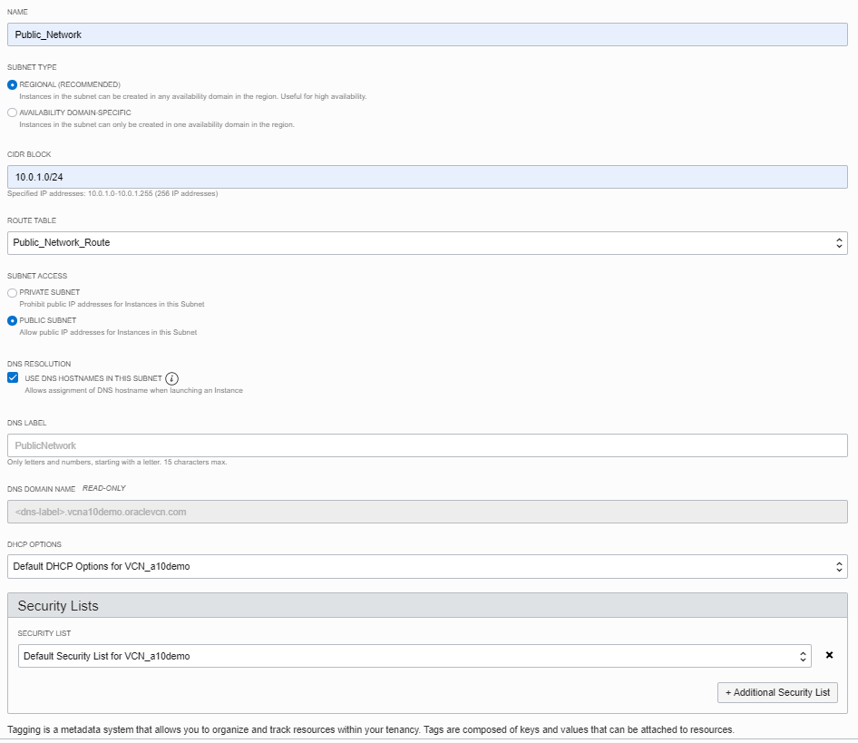
Once completed the Subnets for the VCN will reflect the following:
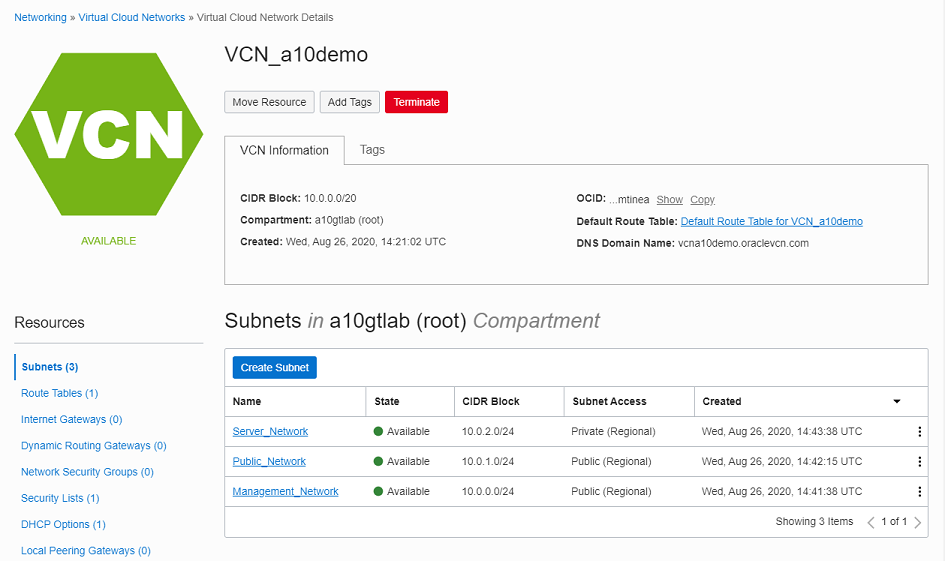

### Modify VCN Security Policy
By default the VCN security policy only allows SSH, ICMP Type 3 code 4, and ICMP type 3 from the VCN main Net block (10.0.0.0/20).  *This policy also applies to device to device connectivity within the VCN subnets*.  For this lab the security policy is set to ANY/ANY all protocols.  

> ***THIS IS NOT RECOMMENDED FOR A PRODUCTION ENVIRONMENT  ONCE THE CONFIGURATION IS COMPLETE PLEASE FOLLOW YOUR COMPANY STANDARDS FOR SECURITY POLICIES***

To modify the security policy, follow the following steps:
1.  From the VCN configuration screen, under Resources, select `Security Lists`
1.  Choose `Default Security List for VCN_a10demo`
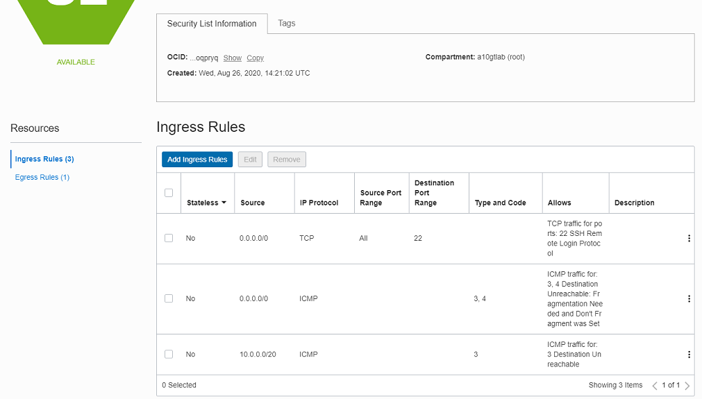
1.  `add ingress rule` with the following settings:
    1.  Source type:  `CIDR`
    1.  Source CIDR:  `0.0.0.0/0`
    1.  IP Protocol:  `All Protocols`
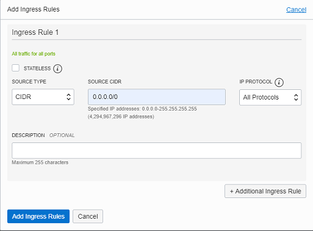
1. `Save Changes`

# Create a10 vThunder instances
TABLE 2: VTHUNDER ADC INSTANCE AND NETWORK CONFIGURATION SPECIFICATIONS

-|PRIMARY ADC|SECONDARY ADC|NOTES
---------------|---------------------|--------------------|---------------
Instance Name|vThunderADC-1|vThunderADC-2|
Availability Domain|AD1|AD2|
Instance Shape|VM.Standard 2.4|VM.Standard 2.4|Selected based on VNIC counts (4) required in this deployment
CONFIGURE NETWORKING
VCN Compartment|a10demo|a10demo
VCN|VCN-a10demo|VCN-a10demo
Subnet Compartment|a10demo|a10demo|
Subnet|Management_Network|Management_Network|For mgmt. interface
Public IP assignment|Yes|Yes

## Create Primary ADC instance
Next a the Secondary ADC instance is created using the following settings.
Name|IP Address|Floating IP
---------|---------|---------
Instance Name|vThunderADC-1|
Management Network|DHCP|
Public Network|10.0.1.11|10.0.1.10
Server Network|10.0.2.11|10.0.2.10

1. From the OCI screen, select the dropdown menu in the upper left corner
1. Select `Compute/Instances`
1. Click on `Create Instance` enter the name from Table 2, `vThunderADC-1`
1.Select `Change Image`

1. Change to `Partner Images` tab and check `A10 vThunder Application Delivery Controller - BYOL`

1. Since this is the `vThunderADC-1` select `AD 1` for the Availability Domain
1. Choose `Change Shape`   

1. For `Instance Type` select `Virtual Machine`, `Shape Series` choose `Intel Skylake`, check the box next to `VM Standard 2.4`      

1. Continue to scroll down the CCI screen to the `Configure Networking` and change `Subnet` to  `Management_Network (Regional)` and validate that `ASSIGN A PUBLIC IP ADDRESS` is selected               

1. After the Network configuration, scroll do the `Add SSH Keys` section.  Select `Choose SSH key FILES` and select the file `Public_Key_authorized_keys.txt` file created in the SSH Key section

1.  Choose `Create` to create the instance.

### ATTACH VNICs to the ADC
By default OCI will only deploy the instance with the Subnet defined in the Create Compute Instance Network Configuration.  The following steps will add the Public and Server networks to the Instance.

1. Select `vThunderADC-1` under the instances List
1. Scroll to the bottom of the page and select `Attached VNICs`

1. Choose `Create VNIC`

1. For name enter `Public_VNIC`,Select a Subnet choose `Public_Network`, Private IP address enter `10.0.1.11` and check 'ASSIGN A PUBLIC IP'

1. Save Changes
1. Select `Create VNIC`
1. For name enter `Server_VNIC`,Select a Subnet choose `Server_Network`, Private IP address enter `10.0.2.11` and check 'ASSIGN A PUBLIC IP'

1. At the top of the instance Details screen, select `Reboot` to restart the instance.  Once the instance restarts the remaining network interfaces are available to ACOS.

## Create Secondary ADC instance
Next a the Secondary ADC instance is created using the following settings.

Name|IP Address|Floating IP
---------|---------|---------
Instance Name|vThunderADC-2|
Management Network|DHCP|
Public Network|10.0.1.12|10.0.1.10
Server Network|10.0.2.12|10.0.2.10

1. From the OCI screen, select the dropdown menu in the upper left corner
1. Select `Compute/Instances`
1. Click on `Create Instance` enter the name from Table 2, `vThunderADC-2`
1.Select `Change Image`          

1. Change to `Partner Images` tab and check `A10 vThunder Application Delivery Controller - BYOL`

1. Since this is the `vThunderADC-2` select `AD 2` for the Availability Domain
1. Choose `Change Shape`                                    

1. For `Instance Type` select `Virtual Machine`, `Shape Series` choose `Intel Skylake`, check the box next to `VM Standard 2.4`.

1. Continue to scroll down the CCI screen to the `Configure Networking` and change `Subnet` to  `Management_Network (Regional)` and validate that `ASSIGN A PUBLIC IP ADDRESS` is selected.           

1. After the Network configuration, scroll do the `Add SSH Keys` section.  Select `Choose SSH key FILES` and select the file `Public_Key_authorized_keys.txt` file created in the SSH Key section

1.  Choose `Create` to create the instance.

### ATTACH VNICs to the ADC
By default OCI will only deploy the instance with the Subnet defined in the Create Compute Instance Network Configuration.  The following steps will add the Public and Server networks to the Instance.

1. Select `vThunderADC-3` under the instances List
1. Scroll to the bottom of the page and select `Attached VNICs`

1. Choose `Create VNIC`

1. For name enter `Public_VNIC`,Select a Subnet choose `Public_Network`, Private IP address enter `10.0.1.12` and check 'ASSIGN A PUBLIC IP'

1. Save Changes
1. Select `Create VNIC`
1. For name enter `Server_VNIC`,Select a Subnet choose `Server_Network`, Private IP address enter `10.0.2.12` and check 'ASSIGN A PUBLIC IP'

1. At the top of the instance Details screen, select `Reboot` to restart the instance.  Once the instance restarts the remaining network interfaces are available to ACOS.

# A10 vThunder CONFIGURATION
## Primary vThunder - Configure Network Interface
The next step is the congiruation of the data plane network interfaces, default gateway, DNS, and Hostname.

>***NOTE:  The Hostname MUST match the Instance name***  

Name|IP Address|Floating IP
---------|---------|---------
Hostname Name|vThunderADC-1|
Management Network|DHCP|
Public Network|10.0.1.11|10.0.1.10
Server Network|10.0.2.11|10.0.2.10

### Configure DNS and Hostname
1. SSH into the public IP address of the vThunderADC-1 instances using the SSH keys created earlier in this document
1. Type `enable` and `config t` to go into configuration mode.
1. Add the DNS server by typing `ip dns primary 8.8.8.8`
1. Add the hostname by typing `vThunderADC-1`
1.  Validate the configuration by issuing a `sh run` command, it should mirror the following (some lines redacted):
```
vThunderADC-1(config)(NOLICENSE)#sh run
!
ip dns primary 8.8.8.8
!
hostname vThunderADC-1
!
end
```
1. Validate that the vThunder recognizes the network interfaces by running the `sh interfaces brief`, below is a sample of the output, if only the management interface is shown issue a reboot command, the interfaces are recognized after the vnics are creaated and the instance is rebooted:
```
vThunderADC-1(config)(NOLICENSE)#sh interfaces brief
Port    Link  Dupl  Speed  Trunk Vlan MAC             IP Address          IPs  Name
------------------------------------------------------------------------------------
mgmt    Up    auto  auto   N/A   N/A  0000.1700.9792  10.0.0.2/24           1
1       Disb  None  None   none  1    0200.1703.f7b9  0.0.0.0/0             0
2       Disb  None  None   none  1    0200.1703.062e  0.0.0.0/0             0
```
1. Set the IP address of the Public Network by creating the following VLANS by issuing the following commands *NOTE: VLAN tagging is disabled, the vlan tags themselves are not use.  Any tag number can be used.  In this example the vlan tag was pulled from the `Attached VNICs` menu*:
```
vlan 2125
untagged ethernet 1
router-interface ve 2125
name "Public Network"
!
interface ve 2125
ip address 10.0.1.11 /24
!
vlan 2126
untagged ethernet 2
router-interface ve 2126
name "Server Network"
!
interface ve 2126
ip address 10.0.2.11 /24
!
```
1.  Validate the configuration by running the 'sh interfaces brief' command again.  Below is an example of the output.
```
vThunderADC-1(config)(NOLICENSE)#sh interfaces brief
Port    Link  Dupl  Speed  Trunk Vlan MAC             IP Address          IPs  Name
------------------------------------------------------------------------------------
mgmt    Up    auto  auto   N/A   N/A  0000.1700.9792  10.0.0.2/24           1
1       Disb  None  None   none  2125 0200.1703.f7b9  0.0.0.0/0             0
2       Disb  None  None   none  2126 0200.1703.062e  0.0.0.0/0             0
ve2125  Down  N/A   N/A    N/A   2125 0200.1703.f7b9  10.0.1.11/24          1
ve2126  Down  N/A   N/A    N/A   2126 0200.1703.062e  10.0.2.11/24          1
```
1. Enable the ethernet interfaces by running the following commands:
```
interface ethernet 1
enable
interface ethernet 2
enable
```
1.  Run the 'sh interfaces brief' command again and the interfaces should reflect the `UP` status
1.  Create a default gateway `ip route 0.0.0.0 /0 10.0.1.1`


**************************************************************************
## Secondary vThunder - Configure Network Interface
The next step is the configuration of the data plane network interfaces, default gateway, DNS, and Hostname.

>***NOTE:  The Hostname MUST match the Instance name***  

Name|IP Address|Floating IP
---------|---------|---------
Hostname Name|vThunderADC-2|
Management Network|DHCP|
Public Network|10.0.1.12|10.0.1.10
Server Network|10.0.2.12|10.0.2.10

### Configure DNS and Hostname
1. SSH into the public IP address of the vThunderADC-1 instances using the SSH keys created earlier in this document
1. Type `enable` and `config t` to go into configuration mode.
1. Add the DNS server by typing `ip dns primary 8.8.8.8`
1. Add the hostname by typing `vThunderADC-2`
1.  Validate the configuration by issuing a `sh run` command, it should mirror the following (some lines redacted):
```
vThunderADC-2(config)(NOLICENSE)#sh run
!
ip dns primary 8.8.8.8
!
hostname vThunderADC-2
!
end
```
1. Validate that the vThunder recognizes the network interfaces by running the `sh interfaces brief`, below is a sample of the output, if only the management interface is shown issue a reboot command, the interfaces are recognized after the vnics are creaated and the instance is rebooted:
```
vThunderADC-2(config)(NOLICENSE)#sh interfaces brief
Port    Link  Dupl  Speed  Trunk Vlan MAC             IP Address          IPs  Name
------------------------------------------------------------------------------------
mgmt    Up    auto  auto   N/A   N/A  0000.1700.9792  10.0.0.4/24           1
1       Disb  None  None   none  1    0200.1703.f7b9  0.0.0.0/0             0
2       Disb  None  None   none  1    0200.1703.062e  0.0.0.0/0             0
```
1. Set the IP address of the Public Network by creating the following VLANS by issuing the following commands *NOTE: VLAN tagging is disabled, the vlan tags themselves are not use.  Any tag number can be used.  In this example the vlan tag was pulled from the `Attached VNICs` menu*:
```
vlan 2125
untagged ethernet 1
router-interface ve 2125
name "Public Network"
!
interface ve 2125
ip address 10.0.1.12 /24
!
vlan 2126
untagged ethernet 2
router-interface ve 2126
name "Server Network"
!
interface ve 2126
ip address 10.0.2.12 /24
!
```
1.  Validate the configuration by running the 'sh interfaces brief' command again.  Below is an example of the output.
```
vThunderADC-1(config)(NOLICENSE)#sh interfaces brief
Port    Link  Dupl  Speed  Trunk Vlan MAC             IP Address          IPs  Name
------------------------------------------------------------------------------------
mgmt    Up    auto  auto   N/A   N/A  0000.1700.9792  10.0.0.2/24           1
1       Disb  None  None   none  2125 0200.1703.f7b9  0.0.0.0/0             0
2       Disb  None  None   none  2126 0200.1703.062e  0.0.0.0/0             0
ve2125  Down  N/A   N/A    N/A   2125 0200.1703.f7b9  10.0.1.11/24          1
ve2126  Down  N/A   N/A    N/A   2126 0200.1703.062e  10.0.2.11/24          1
```
1. Enable the ethernet interfaces by running the following commands:
```
interface ethernet 1
enable
interface ethernet 2
enable
```
1.  Run the 'sh interfaces brief' command again and the interfaces should reflect the `UP` status
1.  Create a default gateway `ip route 0.0.0.0 /0 10.0.1.1`
