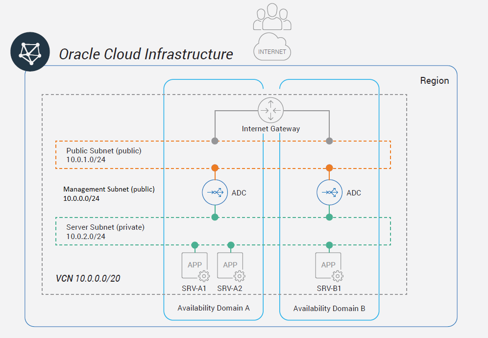

# DEPLOYMENT SCENARIO
For this deployment example,a web application service with a pair if vThunder VM's are deployed in one region using two available domains for redundancy in Oracle Cloud Infrastructure (OCI).

_Figure 1:_ Example deployment topology and network information

# DEPLOYMENT PREREQUISITES
To deploy vThunder ADC for a business application running in OCI, the user needs the following:
* Oracle Cloud Infrastructure accounts and access information
* vThunder ADC (image available in the Oracle Cloud Marketplace)
* vThunder License
* SSH key pair for SSH and console access to vThunder
* Oracle API Public and Private Key pair

# CONFIGURATION STEPS OVERVIEW
The high-level configuration steps of this example deployment are as follows:
1. [Prepare Oracle API Public and Private Keys and A10 Keys for login and HA](./ssh_keys.md)
1. [Oracle Cloud configuration (OCI)](./oci_config.md)
   1. [Create Virtual Cloud Network (VCN)](./oci_config.md#creaatevcn)
   1. Configure Management and Server subnets
   1. Create Public network
   1. Modify VCN Security Policy
1. [Deploy two vThunder ADC instances](./deploy_a10.md)
1. [Configure vThunder ADC](./config_a10.md)
  1. General and interfaces
  1. High-availability (VRRP-A and failover) configuration
  1. SLB virtual service (VIP) configuration
