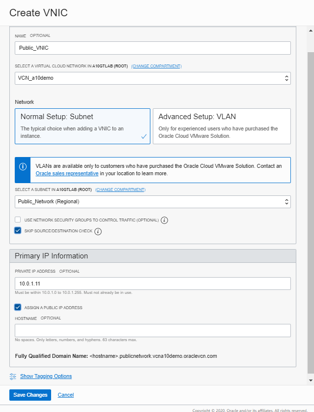

- [Main Menu](./README.md)
- [Previous - OCI Configuration](./oci_config.md)
- [Next - Configure A10 Instances](./config_a10.md)
---
<!-- MDTOC maxdepth:6 firsth1:1 numbering:0 flatten:0 bullets:1 updateOnSave:1 -->

- [Create a10 vThunder instances](#create-a10-vthunder-instances)   
   - [Create Primary ADC instance](#create-primary-adc-instance)   
      - [ATTACH VNICs to the ADC](#attach-vnics-to-the-adc)   
   - [Create Secondary ADC instance](#create-secondary-adc-instance)   
      - [ATTACH VNICs to the ADC](#attach-vnics-to-the-adc)   

<!-- /MDTOC -->

---
# Create a10 vThunder instances
Table 2: VTHUNDER ADC INSTANCE AND NETWORK CONFIGURATION SPECIFICATIONS

-|PRIMARY ADC|SECONDARY ADC|NOTES
---------------|---------------------|--------------------|---------------
Instance Name|vThunderADC-1|vThunderADC-2|
Availability Domain|AD1|AD2|
Instance Shape|VM.Standard 2.4|VM.Standard 2.4|Selected based on VNIC counts (4) required in this deployment
CONFIGURE NETWORKING
VCN Compartment|a10demo|a10demo
VCN|VCN-a10demo|VCN-a10demo
Subnet Compartment|a10demo|a10demo|
Subnet|Management_Network|Management_Network|For mgmt. interface
Public IP assignment|Yes|Yes

## Create Primary ADC instance
Next a the Secondary ADC instance is created using the following settings.

Name|IP Address|Floating IP
---------|---------|---------
Instance Name|vThunderADC-1|
Management Network|DHCP|
Public Network|10.0.1.11|10.0.1.10
Server Network|10.0.2.11|10.0.2.10

1. From the OCI screen, select the dropdown menu in the upper left corner
1. Select `Compute/Instances`
1. Click on `Create Instance` enter the name from Table 2, `vThunderADC-1`
1.Select `Change Image`

1. Change to `Partner Images` tab and check `A10 vThunder Application Delivery Controller - BYOL`

1. Since this is the `vThunderADC-1` select `AD 1` for the Availability Domain
1. Choose `Change Shape`

1. For `Instance Type` select `Virtual Machine`, `Shape Series` choose `Intel Skylake`, check the box next to `VM Standard 2.4`

1. Continue to scroll down the CCI screen to the `Configure Networking` and change `Subnet` to  `Management_Network (Regional)` and validate that `ASSIGN A PUBLIC IP ADDRESS` is selected

1. After the Network configuration, scroll do the `Add SSH Keys` section.  Select `Choose SSH key FILES` and select the file `authorized_keys.pub` file created in the SSH Key section

1.  Choose `Create` to create the instance.

### ATTACH VNICs to the ADC
By default OCI will only deploy the instance with the Subnet defined in the Create Compute Instance Network Configuration.  The following steps will add the Public and Server networks to the Instance.

1. Select `vThunderADC-1` under the instances List
1. Scroll to the bottom of the page and select `Attached VNICs`

1. Choose `Create VNIC`

1. For name enter `Public_VNIC`,Select a Subnet choose `Public_Network`, Private IP address enter `10.0.1.11` and check 'ASSIGN A PUBLIC IP'

1. Save Changes
1. Select `Create VNIC`
1. For name enter `Server_VNIC`,Select a Subnet choose `Server_Network`, Private IP address enter `10.0.2.11` and check 'ASSIGN A PUBLIC IP'

1. At the top of the instance Details screen, select `Reboot` to restart the instance.  Once the instance restarts the remaining network interfaces are available to ACOS.

## Create Secondary ADC instance
Next a the Secondary ADC instance is created using the following settings.

Name|IP Address|Floating IP
---------|---------|---------
Instance Name|vThunderADC-2|
Management Network|DHCP|
Public Network|10.0.1.12|10.0.1.10
Server Network|10.0.2.12|10.0.2.10

1. From the OCI screen, select the dropdown menu in the upper left corner
1. Select `Compute/Instances`
1. Click on `Create Instance` enter the name from Table 2, `vThunderADC-2`
1.Select `Change Image`

1. Change to `Partner Images` tab and check `A10 vThunder Application Delivery Controller - BYOL`

1. Since this is the `vThunderADC-2` select `AD 2` for the Availability Domain
1. Choose `Change Shape`

1. For `Instance Type` select `Virtual Machine`, `Shape Series` choose `Intel Skylake`, check the box next to `VM Standard 2.4`.

1. Continue to scroll down the CCI screen to the `Configure Networking` and change `Subnet` to  `Management_Network (Regional)` and validate that `ASSIGN A PUBLIC IP ADDRESS` is selected.

1. After the Network configuration, scroll do the `Add SSH Keys` section.  Select `Choose SSH key FILES` and select the file `authorized_keys.pub` file created in the SSH Key section

1.  Choose `Create` to create the instance.

### ATTACH VNICs to the ADC
By default OCI will only deploy the instance with the Subnet defined in the Create Compute Instance Network Configuration.  The following steps will add the Public and Server networks to the Instance.

1. Select `vThunderADC-2` under the instances List
1. Scroll to the bottom of the page and select `Attached VNICs`

1. Choose `Create VNIC`

1. For name enter `Public_VNIC`,Select a Subnet choose `Public_Network`, Private IP address enter `10.0.1.12` and check 'ASSIGN A PUBLIC IP'

1. Save Changes
1. Select `Create VNIC`
1. For name enter `Server_VNIC`,Select a Subnet choose `Server_Network`, Private IP address enter `10.0.2.12` and check 'ASSIGN A PUBLIC IP'

1. At the top of the instance Details screen, select `Reboot` to restart the instance.  Once the instance restarts the remaining network interfaces are available to ACOS.
---
- [Main Menu](./README.md)
- [Previous - OCI Configuration](./oci_config.md)
- [Next - Configure A10 Instances](./config_a10.md)
