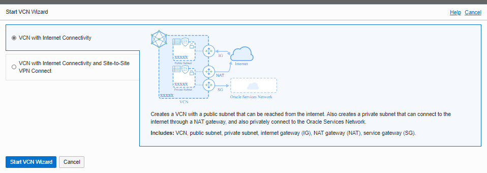
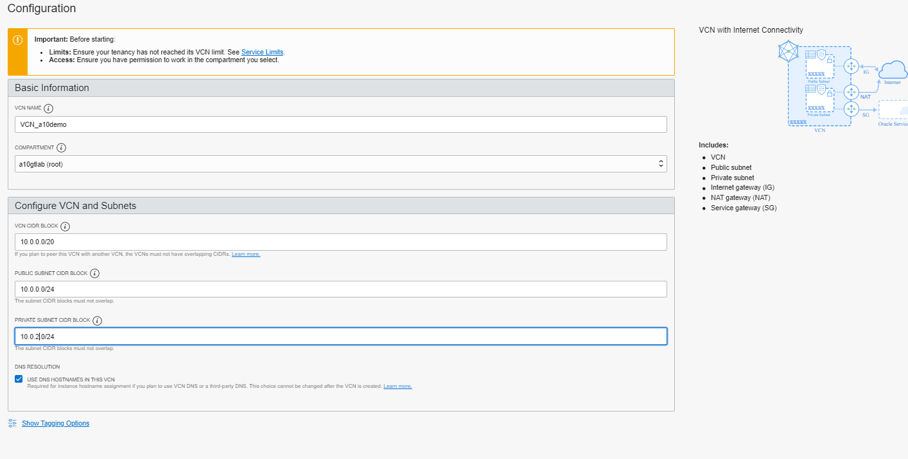
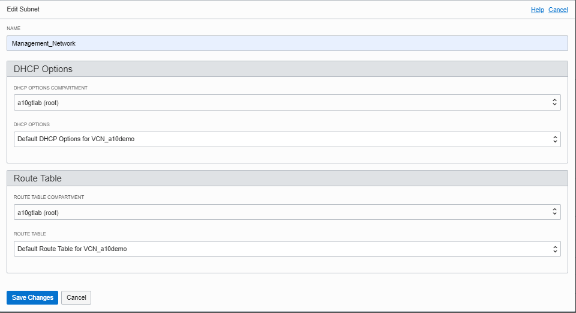
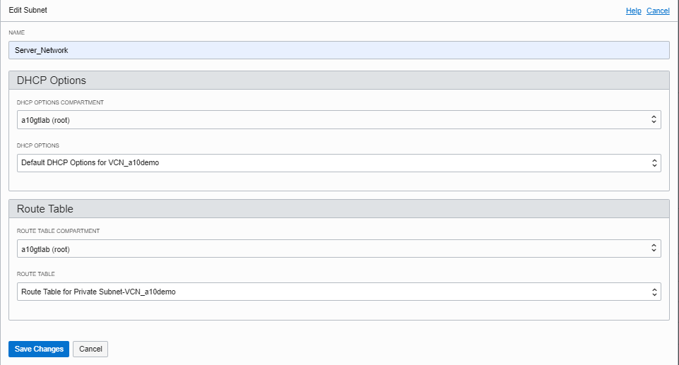
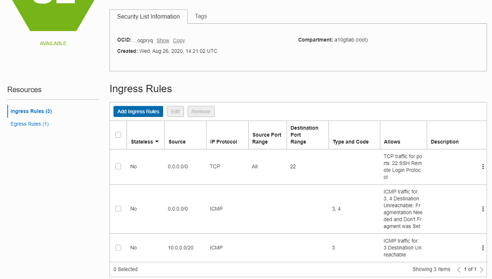
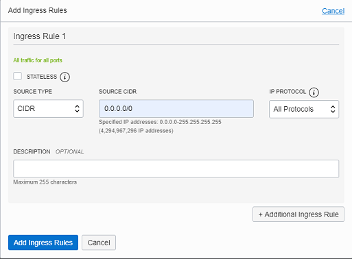
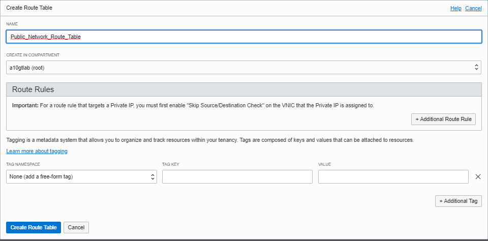
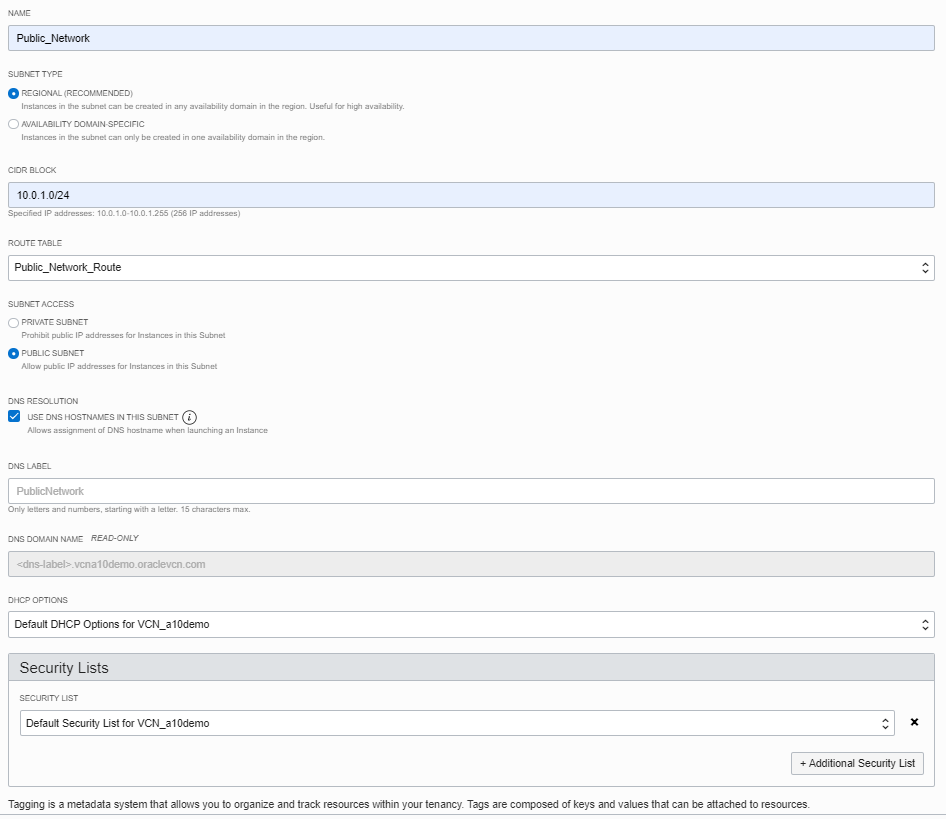
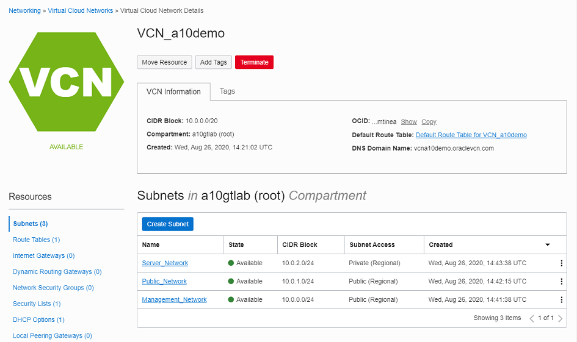
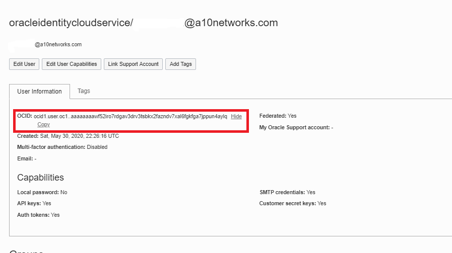

- [Main Menu](./README.md)
- [Previous - SSH Key](./ssh_keys.md)
- [Next - Deploy A10 Instances](./deploy_a10.md)
---
# Configure Oracle Cloud
## [Create Virtual Cloud Network (VCN)](#create_vcn)
The next step is to create the VCN within Oracle Cloud.  Table 1 reflects the VCN network and the sub-networks contained within the VCN.  

**Table 1:  Example VCN and Subnet Assignement**

Components|Name|Value|Notes
--------------|--------------|--------------|--------------
Region|US-West PHoenix||
Available Domains|PHX-AD-1, PHX-AD-2, PHX-AD-3||
VCN|VCN-a10demo|10.0.0.0/20| Main Network that contains subnets below
Subnet|Management|10.0.0.0/24|Public/Regional
 -|Public|10.0.1.0/24|Public/Regional
 -|Server|10.0.2.0/24|Private/Regional
 -|HA|10.0.10.0/24|Private/Regional

### Create VCN
1. Login to the Oracle Cloud web interfaces
1. Select the "hamburger" menu dropdown in the upper left corner, Select `Networking/Virtual Cloud Networks`
1. Click on the `Start VCN Wizard` and
</BR>
1. Fill out the form with the following parameters:
   1. Name:  `VCN_a10demo`
   1. VCN CIDR BLOCK: `10.0.0.0/20`
   1. Public Subnet CIDR Block:  `10.0.0.0/24` *NOTE: This will become the Management Network*
   1. Private Subnet CIDR Block:  `10.0.2.0/24` *NOTE: This will become the Server Network*
      </BR>
1. Select `Next`
1. Select `Create`

### Modify Management and Server subnets
1. Go into the `VCN_a10dmo` configuration page
1. Select `Public Subnet-VCN_a10demo`
1. Select `Edit`
1. Change Name to `Management_Network` and `Save Changes`
    </BR>
1. Select `Pr Subnet-VCN_a10demo`
1. Select `Edit`
1. Change Name to `Server_Network` and `Save Changes`
    </BR>
1.  Choose `Default Security List for VCN_a10demo`
    </BR>
1.  `add ingress rule` with the following settings:
   1.  Source type:  `CIDR`
   1.  Source CIDR:  `0.0.0.0/0`
   1.  IP Protocol:  `All Protocols`
    </BR>
1. `Save Changes`

## Create Public NETWORK
1. Create Route Table by going into Route tables under resources and choosing `Create Route Table`
 </BR>
1. Go the the 'Subnets' screen and select `Create Subnet`
1. Create the Public Network using the following configuration:
   1. Name:  `Public_Network`
   1. Subnet Type:  `Regional`
   1. CIDR BLOCK: `10.0.1.0/24`
   1. Route Table: `Default Route Table for VCN_a10demo`
   1. Subnet Access:  `Public Subnet`
   1. DHCP Options: `Default DHCP Options for VCN_a10demo`
   1. Security List: `Default Security List for VCN_a10demo`
   1. Choose `Create Subnet`
</BR>
Once completed the Subnets for the VCN will reflect the following:
</BR>

### Modify VCN Security Policy
By default the VCN security policy only allows SSH, ICMP Type 3 code 4, and ICMP type 3 from the VCN main Net block (10.0.0.0/20).  *This policy also applies to device to device connectivity within the VCN subnets*.  For this lab the security policy is set to ANY/ANY all protocols.  

> ***THIS IS NOT RECOMMENDED FOR A PRODUCTION ENVIRONMENT  ONCE THE CONFIGURATION IS COMPLETE PLEASE FOLLOW YOUR COMPANY STANDARDS FOR SECURITY POLICIES***

To modify the security policy, follow the following steps:
1.  From the VCN configuration screen, under Resources, select `Security Lists`
1.  Choose `Default Security List for VCN_a10demo`
</BR>
1.  `add ingress rule` with the following settings:
    1.  Source type:  `CIDR`
    1.  Source CIDR:  `0.0.0.0/0`
    1.  IP Protocol:  `All Protocols`
</BR>
1. `Save Changes`

## Oracle Cloud Infrastructure CLI configuration file (txt format)
When the vThunder devices are configured in a reduant pair, they must have the ability to communicate with OCI to move IP address beween the vThunderADC-1 and vThunderADC-2.  When assinging IP addresses to vnics, OCI only allows an IP address to be assigned to one instance and 1 vnic at a time.  When a failover occurs, the vThunder instances send a API call to OCI to remove the Virtal and floating IP address from the Primary to the secondary device.  The config file below provides the VThunder instances the credentials and information to communicate with OCI.  This configuration file will be used later in the implementation process.

To build the `config` document the following information is needed:

* User = User account OCID
* Fingerprint = Public API key fingerprint that was uploaded in the previous step.
* Key file = full path of private API key file on the vThunder
* Pass phrase = add pass phrase if the private key is generated with a pass phrase (optional)
* Tenancy = OCID of the tenancy in which the user will be creating and deploying functions.
* Region = Region identifier of the Oracle Cloud Infrastructure in which the user is deploying services.

Below is an example of a ‘config’ file below to be imported to the vThunder. See the section later in the document for the detailed procedures.
```
    [DEFAULT]
    user=ocid1.user.oc1..aaaaaaa1b2c3d4e5f6g7h8i9j0k1l2m3n4o5p6q7s8t9u0
    fingerprint=1b:2c:3d:4e:5f:6g:7h:8i:9j:0k:1l:2m:3n:4o:5p:6q
    key_file=/a10data/cloud/oci_api_key.pem
    pass_phrase=
    tenancy=ocid1.tenancy.oc1..aaaaaaaagz11111111bbbbbbbb2222222cccccccc3333333333
    region=us-ashburn-1
```
1. To find the `User` account ocid, go to the profile page by clicking on the profile icon in the upper right corner of the OCI window.
</BR>
1. Use the `fingerprint` value that was collected in  the *Set up an Oracle Cloud Infrastructure API Signing Key for Use with Oracle Functions* section.
1. The Key file, leave the same as in the example.
1. To locate the tenancy value,  go to the tenancy page by clicking on the profile icon in the uppper right corner of the OCI window.
</BR>
1. To find the region name Click on the region dropdown at the top of the OCI page and choose Manage Regions.
1. Find the region name that is used for your deployment and copy the `Region identifier`
</BR>

---
- [Main Menu](./README.md)
- [Previous - SSH Key](./ssh_keys.md)
- [Next - Deploy A10 Instances](./deploy_a10.md)
