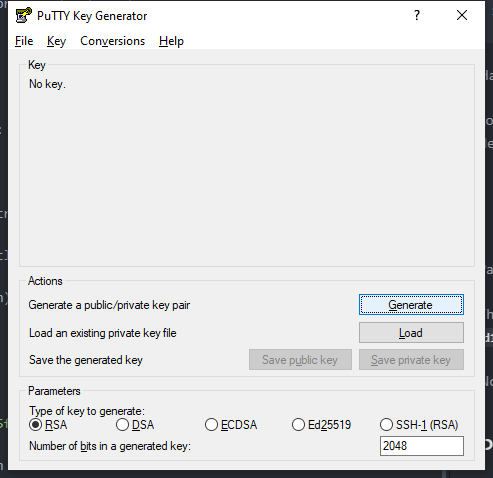
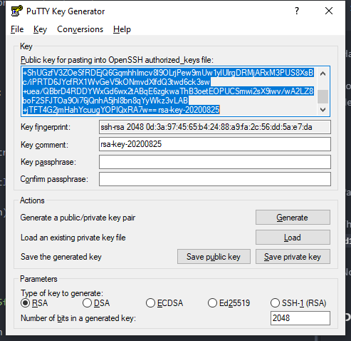
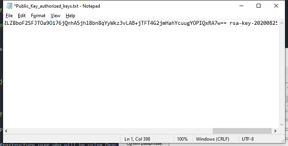

- [Main Menu](./README.md)
- [Next - OCI Configuration](./oci_config.md)
---
<!-- MDTOC maxdepth:6 firsth1:1 numbering:0 flatten:0 bullets:1 updateOnSave:1 -->

- [API and SSH Key Preparation](#api-and-ssh-key-preparation)   
   - [Set up an Oracle Cloud Infrastructure API Signing Key](#set-up-an-oracle-cloud-infrastructure-api-signing-key)   
   - [Prepare vThunder SSH keys](#prepare-vthunder-ssh-keys)   

<!-- /MDTOC -->
---
# API and SSH Key Preparation

API keys are required to perform the VRRP-A failover process in an Oracle Cloud Infrastructure deployment. vThunder supports unicast-based VRRP-A to provide redundancy when an active vThunder goes down for any reason. In the Oracle Cloud environment, a public IP address is assigned for a VIP as a secondary IP on the uplink / gateway facing interface. The secondary public IP address(es) have to be moved from the failed vThunder to a new active vThunder when the failover is triggered. The A10 vThunder in the Oracle Cloud implements this workflow and can automatically move the VIP address(es) and other floating IP addresses to the new active vThunder using API-based Oracle functions.
The following files need to be prepared before starting the vThunder configuration.

* API key pair to create API signing key. For example,
  * Private key: oci_api_key.pem (RSA 2K key, PEM format)
  * Public key: oci_api_key_pub.pem

## Set up an Oracle Cloud Infrastructure API Signing Key
Before using Oracle Functions, you have to set up an Oracle Cloud Infrastructure API signing key for use with Oracle functions.  This will allow the A10 instances to move floating and virtual IP addresses between the A10 active/standby instances.

The instructions in this topic assume:

  * you are using Linux
  * you are following Oracle's recommendation to provide a passphrase to encrypt the private key

To set up an API signing key:

1. Log in to a Linux workstation.
1. In a terminal window, confirm that the `~/.oci` directory does not already exist. For example, by entering:
`ls  ~/.oci`
1. Assuming the `~/.oci` directory does not already exist, create it. For example, by entering:
`mkdir ~/.oci`
1. Generate a private key encrypted with a passphrase that you provide by entering:
```
$ openssl genrsa -out ~/.oci/<private-key-file-name>.pem -aes128 2048
```
where `<private-key-file-name>` is a name of your choice for the private key file (for example, `oci_api_key.pem`).

For example:
```
$ openssl genrsa -out ~/.oci/oci_api_key.pem -aes128 2048
'Generating RSA private key, 2048 bit long modulus'
....+++
....................................................................+++
e is 65537 (0x10001)
Enter pass phrase for /Users/admin/.oci/oci_api_key.pem:
```
When prompted, enter a passphrase to encrypt the private key file.
* Be sure to make a note of the passphrase you enter, as you will need it later.
When prompted, re-enter the passphrase to confirm it.

Confirm that the private key file has been created in the directory you specified. For example, by entering:
```
$ ls -l ~/.oci/oci_api_key.pem

-rw-r--r-- 1 admin staff 1766 Jul 14 00:24 /Users/admin/.oci/oci_api_key.pem
```
Change permissions on the file to ensure that only you can read it. For example, by entering:
```
$ chmod go-rwx ~/.oci/oci_api_key.pem
```
Generate a public key (in the same location as the private key file) by entering:
```
$ openssl rsa -pubout -in ~/.oci/<private-key-file-name>.pem -out ~/.oci/<public-key-file-name>.pem
```
where:

`<private-key-file-name>` is what you specified earlier as the name of the private key file (for example, `oci_api_key.pem`)
`<public-key-file-name>` is a name of your choice for the public key file (for example, `oci_api_key_pub.pem`)

For example:
```
$ openssl rsa -pubout -in ~/.oci/oci_api_key.pem -out ~/.oci/oci_api_key_pub.pem

Enter pass phrase for `/Users/admin/.oci/oci_api_key.pem`:
```
When prompted, enter the same passphrase you previously entered to encrypt the private key file.
Confirm that the public key file has been created in the directory you specified. For example, by entering:
```
$ ls -l ~/.oci/
-rw------- 1 admin staff 1766 Jul 14 00:24 oci_api_key.pem
-rw-r--r-- 1 admin staff 451 Jul 14 00:55 oci_api_key_pub.pem
```
Copy the contents of the public key file you just created. For example, by entering:
```
$ cat ~/.oci/oci_api_key_pub.pem | pbcopy
```
Having created the API key pair, upload the public key value to Oracle Cloud Infrastructure:

Log in to the Console as the Oracle Cloud Infrastructure user who will be using Oracle Functions to create and deploy functions.

1. In the top-right corner of the Console, open the **Profile** menu (User menu icon) and then
1. Click **User Settings** to view the details.
1. On the **API Keys** page, click Add **Public Key**.

Paste the public key's value from the `oci_api_key_pub.pem` into the window and click Add.

The key is uploaded and its fingerprint is displayed (for example, `d1:b2:32:53:d3:5f:cf:68:2d:6f:8b:5f:77:8f:07:13`).

> **Note the fingerprint value. You'll use the fingerprint in a subsequent configuration task.**

## Prepare vThunder SSH keys
During the vThunder deployment an SSH Key pair is required to allow SSH access to the instances after deployment.  The following steps will outline the process to generate the key pair using the `puttygen` utility.
1. Install putty on your workstation from the putty site:  https://www.chiark.greenend.org.uk/~sgtatham/putty/latest.html
1. After the installation is complete run the `puttygen` utility
1. Select `Key` dropdown and verify that it is set to `SSH-2 RSA`
1. For the type of key to generate, select `RSA` with `2048` bits
1. Select the `Generate` button and move the mouse in the empty area until the key has been successfully generated.
 </BR>
1. Click the `Save public key` and save the file as `ssh_key.pub`
1. Click the `Save Private Key` and save the priate key as `ssh_key_priv.ppk` NOTE:  the .ppk file is used by Putty
1. Under the Key section, select the text in the box labeled `Public key for pasting into OpenSSH authorized_keys file`
   1. Right-Click the window and `select-all`
   </BR>
   1. Paste the text into a notepad document and save it in the same folder as the other keys.
   authorized_keys_notepad.png
   1. Save the file as `authorized_keys.pub`
    </BR>
1. Select the `Conversions` dropdown and select `export OpenSSH key` and save the file as `ssh_key.pub`.  This file is used by linux cli ssh for authentication and ssh utilities such as securecrt.
---
- [Main Menu](./README.md)
- [Next - OCI Configuration](./oci_config.md)
