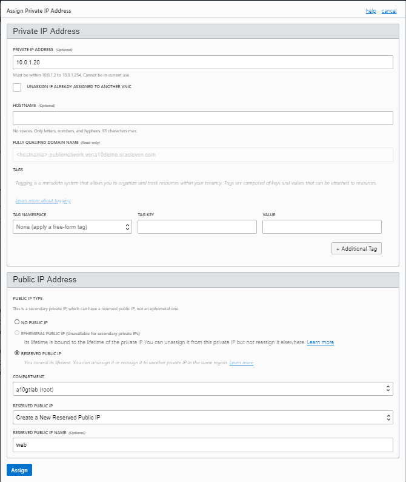
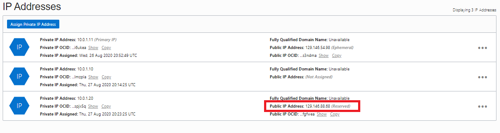

- [Main Menu](./README.md)
- [Previous - Configure A10 Instances](./config_a10.md)
- [Next - NOTHING?](./virtual_a10.md)
---

# CONFIGURE THE VIRTUAL SERVER (VIP) ON VTHUNDER ADC-1

## Add Virtual IP to OCI
Next step is to assign a virtual IP address.  For this the virtual IP address is 10.0.1.20.
1. Login to OCI and go to the instances screen.
1. Select the `vThunderADC-1` instances
   > NOTE:  This portion of the configuration is only completed on the primary (`vThunderADC-1`) device

1. Scroll down to the `Resources` section and select `Attached VNICS`
1. Select `Public_VNIC` and under `Resources` select IP Addresses.
1. First the floating IP address is configured by selecting `Assign Private IP address`
1. On the `Private IP Address` screen fill out the following information:
   * Private IP address:  10.0.1.20
   * Public IP address:  Reserved Public IP
   * Reserved Public IP:  Create a New Reserved Public IP
   * Reserved Public IP Name: web
      
1. Finish the configuration by selecting `Assign`
1. Note the public IP address, this will be the external web site address.
       

The user can configure virtual services, or VIP, using the CLI, GUI, AppCentric Templates (ACT) or Harmony Controller.
In this document, for ease of configuration and operation, ACT is used, the A10 ACOS GUI plug-in module that enhances the user experience to deploy, monitor and troubleshoot applications in a frictionless manner. ACT contains wizard-based configuration tools  for many different applications and use-case configurations, including Basic LB, HTTPS/SSL Offload, MS Exchange, GSLB and more.

## L4 VIP CREATION USING ACT
This section explains how to configure a basic VIP (virtual server) for a port 80 web service using the ACT.
>NOTE: ACT version used in the example is act-v2-1214-17-a10-0.tar.gz

---
- [Main Menu](./README.md)
- [Previous - Configure A10 Instances](./config_a10.md)
